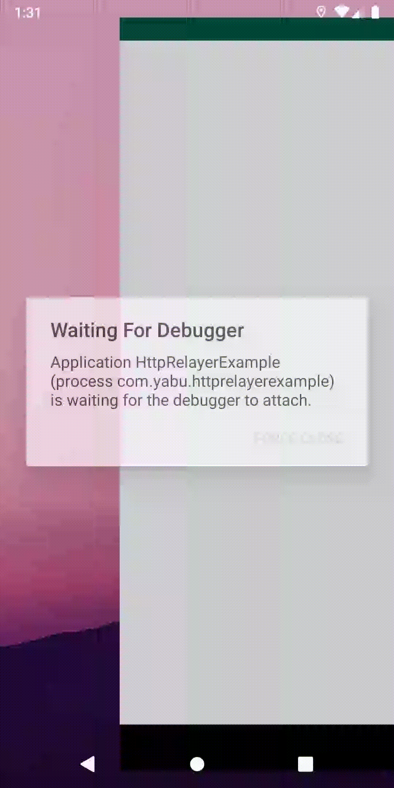
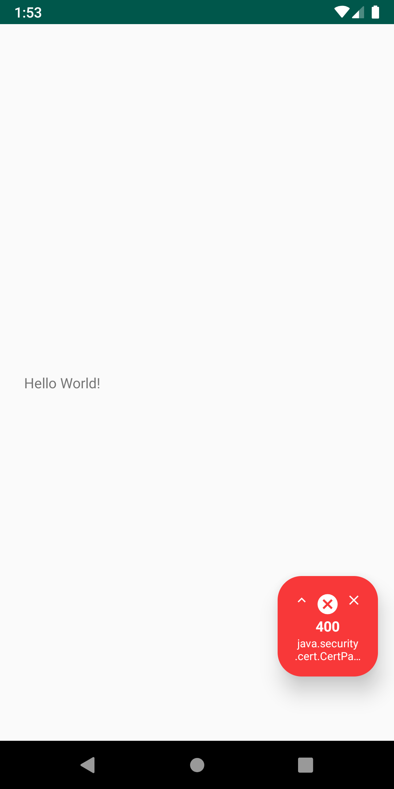
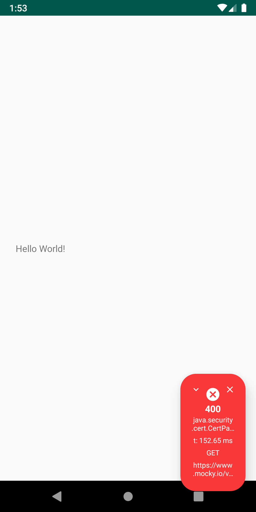

# http-relayer

A simple Http call visual debugger. Display a small dialog on the bottom right of your app screen with an ongoing Http call's status code, message, time taken, and endpoint you are calling.

## How it Works

http-relayer is a Jitpack artifact. Add jitpack url to your repositories and the library to your dependencies:

```groovy
  //project build.gradle
  repositories {
        jcenter()
        maven { url "https://jitpack.io" }
   }
   
   // app build.gradle
   dependencies {
         implementation 'com.github.Pfuster12:http-relayer:1.0.0'
   }
```



As a debug tool, the dialog has an option to remain **null** and not appear. To get a **nullable** dialog object you must pass the context and a boolean flag whether the dialog should appear or not. The `isRelayerOn` flag defaults to **false**. Finally call `.create()` to create the dialog and listener.

```kotlin
val relayer = HttpRelayer.with(context=this, isRelayerOn=true)?.create()
```

Once created you can trigger the dialog to appear by triggering its callback listener in your network calls. For example using `okhttp`:

```kotlin
val client = OkHttpClient()
val request: Request = Request.Builder()
    .url(TEST_URL)
    .build()
    
val relayReq = HttpRelayerRequest(TEST_URL)

relayer?.listener?.onInterceptRequest(relayReq)

client.newCall(request).enqueue(object : Callback {
    override fun onFailure(call: Call, e: IOException) {
        val handler = Handler(context.mainLooper)
        handler.post {
            relayer?.listener?.onInterceptResponse(
                HttpRelayerResponse(
                    relayReq,
                    400,
                    e.message))
        }
    }

    override fun onResponse(call: Call, response: Response) {
        val handler = Handler(context.mainLooper)
        handler.post {
            callback.invoke(response.body?.string() ?: "")
            relayer?.listener?.onInterceptResponse(
                HttpRelayerResponse(
                    relayReq,
                    response.code,
                    response.message
                )
            )
        }
    }
})
```

In order to make the dialog expandable and see more information about the Http call such as time taken and endpoint call the `setVerbose()` method on the dialog object before triggering the listener callbacks:

```kotlin
val relayer = HttpRelayer.with(context=this, isRelayerOn=true)?.create()
relayer?.setVerbose()
```

Success
--------

### Small


### Expanded


Error
--------

### Small



### Expanded


