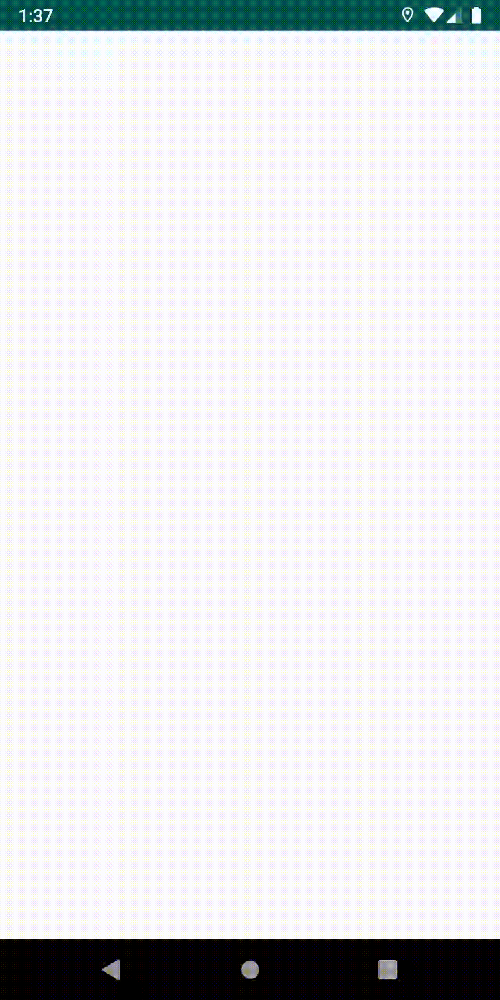

# http-relayer

Http call visual debugger. Display a small dialog on the bottom right of your app screen with an ongoing Http call's status code, message, time taken, and endpoint you are calling.

## How it Works

Success
--------

### Small

### Expanded

Error
--------

### Small

### Expanded

